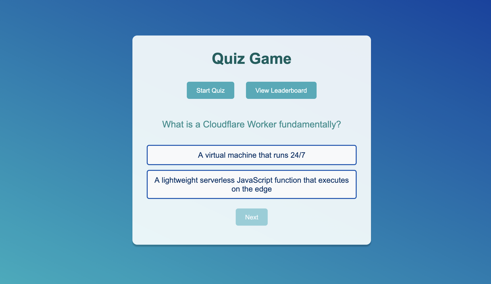

# Cloudflare Quiz

A small, dependency-free quiz game, implemented as a standalone-html, about Cloudflare Workers and related edge platform concepts. It runs entirely in the browser and keeps the top ten
scores in `localStorage`.



## Features

- Start a quiz with the questions defined in `script.js`.
- Select one answer per question and immediately see the correct answer.
- Track the score across the full question set.
- Save a name and score to a local top-ten leaderboard.
- View or clear saved scores at any time.
- Responsive layout constrained to a single centered game panel.

## Running the game

No build step, package manager, or server-side runtime is required.

1. Clone or download the repository.
2. Open `index.html` in a modern web browser.
3. Select **Start Quiz** to play.

## How the game logic works

### 1. Views and navigation

`index.html` contains four sections inside the main container:

- `.home`: start the quiz or open the leaderboard.
- `.quiz`: display the current question, answer options, and the **Next**
  button.
- `.result`: display the final score and collect a player name.
- `.leaderboard`: list and clear saved scores.

Only one section is visible at a time. `showSection(section)` removes the
`active` class from every section and adds it to the requested section. In
`style.css`, sections are hidden by default and `.active` changes them to
`display: block`.

### 2. Starting and displaying questions

The top-level variables `currentQuestion` and `score` hold the active game
state. `startQuiz()` resets both values, switches to the quiz view, and calls
`showQuestion()`.

Questions are stored in the `questions` array. Each question has this shape:

```js
{
  question: "Question text",
  options: ["First answer", "Second answer"],
  answer: 1 // zero-based index of the correct option
}
```

`showQuestion()` reads the question at `questions[currentQuestion]`, updates
the question heading, creates one clickable `.option` element per answer, and
disables **Next** until an answer is selected.

### 3. Selecting an answer

`selectOption(selected)` compares the clicked option index with the question's
`answer` index. It then:

1. Adds `.correct` to the right option and `.incorrect` to the other options.
2. Removes the click handlers so the question cannot be answered twice.
3. Increments `score` when the selected index is correct.
4. Enables **Next**.

The CSS classes provide the visual feedback: correct answers are green, while
incorrect answers are red and crossed out.

### 4. Advancing and finishing

`nextQuestion()` increments `currentQuestion`. If questions remain, it calls
`showQuestion()` again. After the final question, it switches to the result
view and renders the score as `score / questions.length`.

### 5. Saving and displaying scores

When **Save Score** is clicked, `saveScore()` trims the entered name and
requires it to be non-empty. It then:

1. Reads the existing `highScores` JSON array from `localStorage`.
2. Appends `{ name, score }`.
3. Sorts entries by score in descending order.
4. Keeps only the first ten entries.
5. Writes the result back to `localStorage`.
6. Opens the leaderboard.

`showLeaderboard()` reads the same key and creates one list item per score.
`clearScores()` removes the key and refreshes the empty leaderboard. Scores are
stored in the current browser profile, so they are not shared between devices
or browsers.

## Customizing the quiz

Add, remove, or edit entries in the `questions` array at the bottom of
`script.js`. Keep `answer` as a zero-based index that points to an item in the
same question's `options` array. The score limit and result display update
automatically from `questions.length`.

To change the presentation, edit the selectors in `style.css`. Navigation and
game behavior are wired through the element IDs in `index.html` and the event
listeners near the top of `script.js`.

## Browser compatibility

The game uses standard DOM APIs, `localStorage`, and modern JavaScript syntax.
Use a current version of Chrome, Firefox, Safari, or Edge.
